<div align="center">

  # 🖥️ CFDesktop
  ### **一个可部署到任意支持 Qt 的嵌入式设备上的现代化桌面框架**

  [](LICENSE)
  [](https://en.cppreference.com/w/C++23)
  [](https://www.qt.io/)
  [](https://cmake.org/)
  []()

  [功能特性](#-功能特性) • [快速开始](#-快速开始) • [开发文档](#-开发文档) • [技术栈](#-技术栈)

</div>

---

## 📖 项目简介

**CFDesktop** 旨在为各种嵌入式设备提供统一、现代化的桌面环境。通过模块化设计和硬件能力分级，CFDesktop 能够根据设备性能动态调整用户体验，从低端 ARM 设备到高性能 RK3588 平台都能流畅运行。

### 💡 设计理念

| 理念 | 描述 |
|:---:|:---|
| 🌍 **跨平台** | 支持 Windows/Linux 嵌入式设备，可移植到多种架构 |
| ⚡ **性能自适应** | 根据设备硬件能力自动调整 UI 特效和功能 |
| 🛠️ **开发友好** | 提供完整的 SDK 和模拟器，简化应用开发 |
| 🧩 **模块化** | 各功能模块解耦，便于裁剪和定制 |

---

## 🚀 当前进度

### ✅ 已完成

```diff
+1. Boot Test 环境检测
     ✓ 编译前自动检测依赖是否齐全，确保可以编译通过
     ✓ 支持控制台和 GUI 两种运行模式
     ✓ 提供详细的 Qt 环境检测报告

+2. VSCode + Clangd 开发环境
     ✓ 自动生成 clangd 配置
     ✓ 保证与 QtCreator 几乎一致的丝滑开发体验
     ✓ 支持 C++23 语法高亮和代码补全
     ✓ 自动生成 launch.json 和 tasks.json（支持 GDB/LLDB 调试）

+3. 自动化构建脚本
     ✓ Windows PowerShell 构建脚本
     ✓ Linux Bash 构建脚本
     ✓ 支持多种工具链配置（LLVM/GCC）
     ✓ 部署（deploy）与开发（develop）双模式构建
     ✓ 新增测试运行脚本（windows_run_tests.ps1 / linux_run_tests.sh）

+4. CMake 基础设施
     ✓ 模块化 CMake 架构
     ✓ 自定义日志输出系统
     ✓ 工具链检测与配置管理
     ✓ 编译命令生成（compile_commands.json）
     ✓ 第三方依赖管理（third_party_helper.cmake）
     ✓ 自动化输出目录配置（bin/lib 分离）

+5. 硬件探针模块（Phase 1）
     ✓ CPU 信息检测（型号、核心数、频率）
     ✓ CPU Profile 和 Features 检测
     ✓ 内存信息检测（Windows 平台完成）

+6. Base 基础库（Phase 2）
     ✓ 统一 cfbase.dll 动态库架构
     ✓ expected 类型（std::expected 风格的错误处理）
     ✓ scope_guard（RAII 风格的资源管理）

+7. UI 组件库（Phase 4 - 提前启动）
     ✓ Material Design 规范文档（MaterialRules.md）
     ✓ 基础数学工具（math_helper）
     ✓ 颜色处理工具（color_helper, color）
     ✓ 缓动曲线封装（easing）
     ✓ 几何图形工具（geometry_helper）
     ✓ 设备像素转换（device_pixel）

+8. P0 Widgets 核心组件
     ✓ Button - 按钮组件
     ✓ Label - 标签组件
     ✓ TextField - 文本输入框
     ✓ TextArea - 多行文本区域
     ✓ CheckBox - 复选框
     ✓ RadioButton - 单选按钮
     ✓ GroupBox - 分组框

+9. Material Design 应用程序框架
     ✓ 应用程序抽象层
     ✓ 焦点环（Focus Ring）
     ✓ 波纹效果（Ripple）
     ✓ 高度控制器（Elevation Controller）
     ✓ 状态机（State Machine）

+10. 动画系统
     ✓ Spring 动画
     ✓ 时间动画
     ✓ 淡入淡出动画
     ✓ 缩放动画
     ✓ 滑动动画
     ✓ 动画工厂和管理器

+11. 主题引擎
     ✓ 主题抽象层
     ✓ 令牌系统（Token System）
     ✓ 颜色方案管理
     ✓ 运动规格管理
     ✓ 半径缩放管理
     ✓ 字体类型管理

+12. Doxygen 文档系统
     ✓ Doxyfile 配置
     ✓ 文件扫描器
     ✓ 代码注释规范
     ✓ lint.py 检查工具
```

### 🚧 开发中

| 模块 | 状态 | 阶段 |
|:---|:---:|:---:|
| 🔍 硬件探针模块 | ⏳ 进行中 | Phase 1 |
| 📦 Base 基础库 | ⏳ 进行中 | Phase 2 |
| 🎨 UI 组件库 | ✅ 核心完成 | Phase 4 |
| ⌨️ 输入抽象层 | 📋 计划中 | Phase 3 |

---

## 🎯 功能特性

<details>
<summary><b>🔍 点击展开核心功能</b></summary>

#### 🖥️ 硬件能力检测
- 自动检测 CPU、GPU、内存性能
- 动态调整 UI 复杂度
- 智能资源管理

#### 🎨 现代化 UI
- Material Design 3 完整实现
- 流畅的动画效果（Spring、淡入淡出、缩放、滑动）
- 响应式布局
- 主题定制支持（颜色、运动、半径、字体）
- P0 核心组件（Button、Label、TextField 等）

#### 🧩 模块化架构
- 插件式扩展
- 松耦合设计
- 易于维护和升级

#### 🛠️ 开发工具链
- 完整的 SDK
- Doxygen 文档系统
- VSCode + Clangd 集成
- 示例程序（Material Gallery、主题定制）

</details>

---

## 🏁 快速开始

### 📋 前置要求

| 依赖 | 最低版本 | 推荐版本 |
|:---|:---:|:---:|
| **编译器** | LLVM/Clang 或 GCC | 最新版 |
| **CMake** | 3.16 | 3.20+ |
| **Qt** | 6.8.3 | 6.8+ |

### 💻 Windows 构建

```powershell
# 配置 CMake
.\scripts\build_helpers\windows_configure.ps1

# 快速构建（推荐日常开发）
.\scripts\build_helpers\windows_fast_develop_build.ps1
.\scripts\build_helpers\windows_fast_deploy_build.ps1

# 完整构建（包含完整清理流程）
.\scripts\build_helpers\windows_develop_build.ps1
.\scripts\build_helpers\windows_deploy_build.ps1

# 运行测试
.\scripts\build_helpers\windows_run_tests.ps1
```

### 🐧 Linux 构建

```bash
# 配置 CMake
./scripts/build_helpers/linux_configure.sh

# 快速构建（推荐日常开发）
./scripts/build_helpers/linux_fast_develop_build.sh
./scripts/build_helpers/linux_fast_deploy_build.sh

# 运行测试
./scripts/build_helpers/linux_run_tests.sh
```

### ⚙️ 构建配置

| 配置文件 | 用途 | 输出目录 |
|:---|:---|:---|
| `build_deploy_config.ini` | 部署构建 | `out/build_deploy` |
| `build_develop_config.ini` | 开发构建 | `out/build_develop` |

可在配置文件中调整 CMake 生成器、工具链等参数。

### 📝 构建脚本说明

| 脚本类型 | 说明 | 适用场景 |
|:---|:---|:---|
| `configure` | 仅运行 CMake 配置 | 首次配置或修改 CMakeLists 后 |
| `fast_*_build` | 增量编译 | 日常开发（跳过清理，更快） |
| `*_build` | 完整构建 | 需要完全重新编译时 |

---

## 🛠️ 开发环境

### 🤝 VSCode + Clangd

项目已配置自动生成 VSCode 开发配置。首次运行 CMake 配置后：

**在构建目录生成：**
- `.vscode/launch.json` - 调试配置（自动检测 GDB/LLDB）
- `.vscode/tasks.json` - 构建任务（CMake Configure/Build/Clean/CTest）
- `.clangd` - Clangd 语言服务器配置

**提供的功能：**
- ✨ 精准的代码补全
- ✔️ 实时语法检查
- 🔍 跳转到定义
- 🔧 重构支持
- 🐛 一键调试（F5）
- 📦 快速构建（Ctrl+Shift+B）

### 🎨 QtCreator

也可以直接使用 QtCreator 打开 `CMakeLists.txt` 进行开发。

---

## 📺 示例程序

项目包含多个示例程序，展示 CFDesktop 的各项功能：

| 示例 | 描述 |
|:---|:---|
| **Material Gallery** | Material Design 组件展示 |
| **主题定制** | 颜色、运动、半径、字体定制示例 |
| **Widget 组件** | P0 核心控件演示 |

运行示例：
```powershell
# Windows
.\out\build_deploy\bin\material_gallery.exe
```

---

## 📚 开发文档

详细的设计文档请查看 [document/design_stage/](document/design_stage/)：

| 文档 | 内容 | 阶段 |
|:---|:---|:---:|
| [工程骨架搭建](document/design_stage/00_phase0_project_skeleton.md) | 项目基础设施与环境配置 | Phase 0 |
| [硬件探针与能力分级](document/design_stage/01_phase1_hardware_probe.md) | 硬件检测与性能评估 | Phase 1 |
| [Base 库核心功能](document/design_stage/02_phase2_base_library.md) | 基础库设计与实现 | Phase 2 |
| [输入抽象层](document/design_stage/03_phase3_input_layer.md) | 输入设备统一接口 | Phase 3 |
| [多平台模拟器](document/design_stage/04_phase6_simulator.md) | 开发调试模拟器 | Phase 6 |
| [测试体系](document/design_stage/05_phase8_testing.md) | 单元测试与集成测试 | Phase 8 |

---

## 📋 TODO

项目开发任务清单请查看 [document/todo/](document/todo/)：

| 资源 | 描述 |
|:---|:---|
| [TODO 看板](document/todo/index.md) | 各模块任务清单与进度跟踪 |
| [项目状态报告](document/todo/done/PROJECT_STATUS_REPORT.md) | 整体完成度与优先级建议 |
| [参考文档](document/todo/done/) | 各模块实现参考文档 |

---

## 🔧 技术栈

<div align="center">

```
┌─────────────────────────────────────────────────────────┐
│                    CFDesktop 架构                         │
├─────────────────────────────────────────────────────────┤
│  C++23  │  Qt 6.8.3  │  CMake  │  LLVM/Clang  │  Ninja  │
└─────────────────────────────────────────────────────────┘
```

| 技术 | 版本 | 用途 |
|:---|:---:|:---|
| **C++** | 23 | 核心开发语言 |
| **CMake** | 3.16+ | 构建系统 |
| **Qt** | 6.8.3+ | UI 框架 |
| **LLVM/Clang** | 最新 | 编译器（首选）|
| **GCC** | 最新 | Linux 编译器 |
| **Ninja** | - | 构建工具 |

</div>

---

## 🗺️ 路线图

```mermaid
graph LR
    A[Phase 0<br/>工程骨架] --> B[Phase 1<br/>硬件探针]
    B --> C[Phase 2<br/>Base 库]
    C --> D[Phase 3<br/>输入抽象层]
    D --> E[Phase 4<br/>UI 组件库]
    E --> F[Phase 5<br/>窗口管理器]
    F --> G[Phase 6<br/>模拟器]
    G --> H[Phase 7<br/>应用框架]
    H --> I[Phase 8<br/>测试体系]
    I --> J[Phase 9<br/>文档完善]
    J --> K[Phase 10<br/>发布准备]

    style A fill:#4CAF50
    style B fill:#2196F3
    style C fill:#9E9E9E
    style D fill:#9E9E9E
    style E fill:#2196F3
    style F fill:#9E9E9E
    style G fill:#9E9E9E
    style H fill:#9E9E9E
    style I fill:#9E9E9E
    style J fill:#9E9E9E
    style K fill:#9E9E9E
```

<details>
<summary><b>📅 查看完整开发计划</b></summary>



</details>

---

## 🤝 贡献

欢迎贡献代码、报告问题或提出建议！

---

## 📄 许可证

本项目采用 [MIT](LICENSE) 开源许可证。

---

<div align="center">

  **Made with ❤️ for embedded devices**

  *最后更新: 2026-03-01*

  [⬆ 返回顶部](#-cfdesktop)

</div>
