<div align="center">

  # CFDesktop

  ### 一个可部署到任意支持 Qt 的嵌入式设备上的现代化桌面框架

  [](https://opensource.org/licenses/MIT)
  [](https://github.com)
  [](https://en.cppreference.com/w/C++23)
  [](https://www.qt.io/)
  [](https://cmake.org/)
  []()

  [功能特性](#-功能特性) &bull; [快速开始](#-快速开始) &bull; [开发文档](#-开发文档) &bull; [路线图](#-路线图)

</div>

---

## 简介

**CFDesktop** 旨在为各种嵌入式设备提供统一、现代化的桌面环境。通过模块化设计和硬件能力分级，CFDesktop 能够根据设备性能动态调整用户体验，从低端 ARM 设备到高性能 RK3588 平台都能流畅运行。

### 设计理念

| 理念 | 描述 |
|:---:|:---|
| **跨平台** | 支持 Windows/Linux 嵌入式设备，可移植到多种架构 (x86_64/ARM64/ARMhf) |
| **性能自适应** | 根据设备硬件能力自动调整 UI 特效和功能 |
| **开发友好** | 提供完整的 SDK 和模拟器，简化应用开发 |
| **模块化** | 各功能模块解耦，便于裁剪和定制 |

---

## 当前进度

> **版本**: 0.9.2 | **状态**: 活跃开发中

### 已完成

```diff
+ 基础设施 (Phase 0)
  ✓ Boot Test 环境检测系统
  ✓ VSCode + Clangd 开发环境配置
  ✓ 自动化构建脚本 (PowerShell/Bash)
  ✓ CMake 模块化架构
  ✓ Git Hooks 验证系统
  ✓ Docker 多架构构建支持

+ 硬件探针模块 (Phase 1)
  ✓ CPU 信息检测 (型号、核心数、频率)
  ✓ CPU Profile 和 Features 检测
  ✓ 内存信息检测 (Windows 平台)

+ Base 基础库 (Phase 2)
  ✓ 统一 cfbase.dll 动态库架构
  ✓ expected 类型 (std::expected 风格)
  ✓ scope_guard (RAII 风格资源管理)
  ✓ constexpr_fnv1a 哈希实现
  ✓ weak_ptr 辅助工具

+ UI 组件库 (Phase 4 - 提前启动)
  ✓ Material Design 规范文档
  ✓ 基础数学工具 (math_helper)
  ✓ 颜色处理工具 (color_helper, color)
  ✓ 缓动曲线封装 (easing)
  ✓ 几何图形工具 (geometry_helper)
  ✓ 设备像素转换 (device_pixel)

+ P0 Widgets 核心组件
  ✓ Button - 按钮组件
  ✓ Label - 标签组件
  ✓ TextField - 文本输入框
  ✓ TextArea - 多行文本区域
  ✓ CheckBox - 复选框
  ✓ RadioButton - 单选按钮
  ✓ GroupBox - 分组框

+ Material Design 应用程序框架
  ✓ 应用程序抽象层
  ✓ 焦点环 (Focus Ring)
  ✓ 波纹效果 (Ripple)
  ✓ 高度控制器 (Elevation Controller)
  ✓ 状态机 (State Machine)
  ✓ 绘制层 (Painter Layer)

+ 动画系统
  ✓ Spring 弹簧动画
  ✓ 时间动画
  ✓ 淡入淡出动画
  ✓ 缩放动画
  ✓ 滑动动画
  ✓ 动画工厂和管理器

+ 主题引擎
  ✓ 主题抽象层
  ✓ 令牌系统 (Token System)
  ✓ 颜色方案管理
  ✓ 运动规格管理
  ✓ 半径缩放管理
  ✓ 字体类型管理

+ 文档系统
  ✓ Doxygen 配置
  ✓ 文件扫描器
  ✓ 代码注释规范
  ✓ MkDocs 自动部署
```

### 开发中

| 模块 | 状态 | 阶段 | 进度 |
|:---|:---:|:---:|:---:|
| 硬件探针模块 | 进行中 | Phase 1 | 60% |
| Base 基础库 | 进行中 | Phase 2 | 40% |
| UI 组件库 | 核心完成 | Phase 4 | 70% |
| 输入抽象层 | 计划中 | Phase 3 | 0% |

---

## 功能特性

<details>
<summary><b>点击展开核心功能</b></summary>

### 硬件能力检测
- 自动检测 CPU、GPU、内存性能
- 动态调整 UI 复杂度
- 智能资源管理

### 现代化 UI
- Material Design 3 完整实现
- 流畅的动画效果 (Spring、淡入淡出、缩放、滑动)
- 响应式布局
- 主题定制支持 (颜色、运动、半径、字体)
- P0 核心组件 (Button、Label、TextField 等)

### 模块化架构
- 插件式扩展
- 松耦合设计
- 易于维护和升级

### 开发工具链
- 完整的 SDK
- Doxygen 文档系统
- VSCode + Clangd 集成
- 示例程序 (Material Gallery、主题定制)

</details>

---

## 快速开始

### 前置要求

| 依赖 | 最低版本 | 推荐版本 |
|:---|:---:|:---:|
| **编译器** | LLVM/Clang 或 GCC | 最新版 |
| **CMake** | 3.16 | 3.20+ |
| **Qt** | 6.8.3 | 6.8+ |

### Windows 构建

```powershell
# 克隆仓库
git clone https://github.com/your-org/CFDesktop.git
cd CFDesktop

# 快速构建 (推荐日常开发)
.\scripts\build_helpers\windows_fast_develop_build.ps1

# 运行测试
.\scripts\build_helpers\windows_run_tests.ps1
```

### Linux 构建

```bash
# 克隆仓库
git clone https://github.com/your-org/CFDesktop.git
cd CFDesktop

# 快速构建
./scripts/build_helpers/linux_fast_develop_build.sh

# 运行测试
./scripts/build_helpers/linux_run_tests.sh
```

### Docker 构建 (多架构)

```bash
# AMD64 构建验证
bash scripts/build_helpers/docker_start.sh --verify

# ARM64 构建验证
bash scripts/build_helpers/docker_start.sh --arch arm64 --verify
```

### 构建配置说明

| 配置文件 | 用途 | 输出目录 |
|:---|:---|:---|
| `build_deploy_config.ini` | 部署构建 | `out/build_deploy` |
| `build_develop_config.ini` | 开发构建 | `out/build_develop` |

---

## 开发环境

### VSCode + Clangd (推荐)

项目已配置自动生成 VSCode 开发配置：

**自动生成文件**:
- `.vscode/launch.json` - 调试配置 (自动检测 GDB/LLDB)
- `.vscode/tasks.json` - 构建任务
- `.clangd` - Clangd 语言服务器配置

**功能支持**:
- 精准的代码补全
- 实时语法检查
- 跳转到定义
- 重构支持
- 一键调试 (F5)
- 快速构建 (Ctrl+Shift+B)

### QtCreator

也可以直接使用 QtCreator 打开 `CMakeLists.txt` 进行开发。

---

## 示例程序

| 示例 | 描述 |
|:---|:---|
| **Material Gallery** | Material Design 组件展示 |
| **主题定制** | 颜色、运动、半径、字体定制示例 |
| **Widget 组件** | P0 核心控件演示 |

运行示例：
```powershell
# Windows
.\out\build_deploy\bin\material_gallery.exe
```

---

## 开发文档

| 文档 | 内容 | 阶段 |
|:---|:---|:---:|
| [工程骨架搭建](document/design_stage/00_phase0_project_skeleton.md) | 项目基础设施与环境配置 | Phase 0 |
| [硬件探针与能力分级](document/design_stage/01_phase1_hardware_probe.md) | 硬件检测与性能评估 | Phase 1 |
| [Base 库核心功能](document/design_stage/02_phase2_base_library.md) | 基础库设计与实现 | Phase 2 |
| [输入抽象层](document/design_stage/03_phase3_input_layer.md) | 输入设备统一接口 | Phase 3 |
| [多平台模拟器](document/design_stage/04_phase6_simulator.md) | 开发调试模拟器 | Phase 6 |
| [测试体系](document/design_stage/05_phase8_testing.md) | 单元测试与集成测试 | Phase 8 |

**TODO 任务清单**: [document/todo/](document/todo/)

---

## 技术栈

<div align="center">

```
┌─────────────────────────────────────────────────────────────────┐
│                        CFDesktop 架构                           │
├─────────────────────────────────────────────────────────────────┤
│  C++23  │  Qt 6.8.3  │  CMake  │  LLVM/Clang  │  Ninja        │
├─────────────────────────────────────────────────────────────────┤
│  VSCode  │  Clangd  │  Git Hooks  │  Docker  │  MkDocs        │
└─────────────────────────────────────────────────────────────────┘
```

| 技术 | 版本 | 用途 |
|:---|:---:|:---|
| **C++** | 23 | 核心开发语言 |
| **CMake** | 3.16+ | 构建系统 |
| **Qt** | 6.8.3+ | UI 框架 |
| **LLVM/Clang** | 最新 | 编译器 (首选) |
| **GCC** | 最新 | Linux 编译器 |
| **Ninja** | - | 构建工具 |
| **Docker** | - | 多架构构建验证 |

</div>

---

## 路线图

```mermaid
graph LR
    A[Phase 0<br/>工程骨架] --> B[Phase 1<br/>硬件探针]
    B --> C[Phase 2<br/>Base 库]
    C --> D[Phase 3<br/>输入抽象层]
    D --> E[Phase 4<br/>UI 组件库]
    E --> F[Phase 5<br/>窗口管理器]
    F --> G[Phase 6<br/>模拟器]
    G --> H[Phase 7<br/>应用框架]
    H --> I[Phase 8<br/>测试体系]
    I --> J[Phase 9<br/>文档完善]
    J --> K[Phase 10<br/>发布准备]

    style A fill:#4CAF50
    style B fill:#2196F3
    style C fill:#9C27B0
    style D fill:#9E9E9E
    style E fill:#2196F3
    style F fill:#9E9E9E
    style G fill:#9E9E9E
    style H fill:#9E9E9E
    style I fill:#9E9E9E
    style J fill:#9E9E9E
    style K fill:#9E9E9E
```

<details>
<summary><b>查看完整开发计划</b></summary>



**当前阶段**: Phase 1-2 并行开发，Phase 4 核心组件已完成

</details>

---

## 版本管理策略

| 版本类型 | 验证要求 |
|:---|:---|
| **Major** (x.y.z → x+1.0.0) | X64 + ARM64 完整构建 + 测试 |
| **Minor** (x.y.z → x.y+1.0) | X64 完整构建 + 测试 |
| **Patch** (x.y.z → x.y.z+1) | X64 快速构建 + 测试 |

详见: [scripts/release/README.md](scripts/release/README.md)

---

## 贡献

欢迎贡献代码、报告问题或提出建议！

请查看 [CONTRIBUTING.md](CONTRIBUTING.md) 了解贡献指南。

---

## 许可证

本项目采用 [MIT](LICENSE) 开源许可证。

---

<div align="center">

  **Made with ❤️ for embedded devices**

  *版本: 0.9.0 | 最后更新: 2026-03-07*

  [⬆ 返回顶部](#cfdesktop)

</div>
